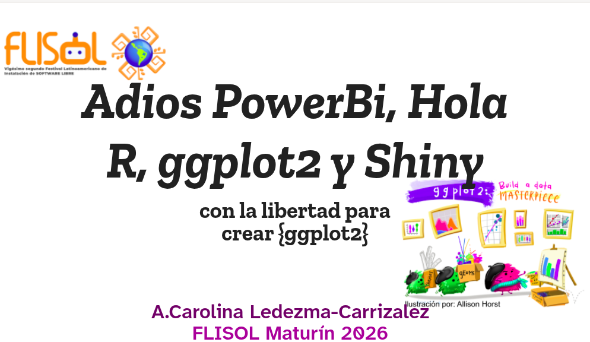

# Presentation-Flisol-2026-Maturin-Venezuela
Presentation-Flisol-2026-Maturin-Venezuela

## [Inspiración - Inspiration](https://z3tt.github.io/ggiraph-user-2025/slides.html#/title-slide)

## Slides: [Presentacion](https://carolaledezma.github.io/Presentation-Flisol-2026-Maturin-Venezuela/index.html#/title-slide)

# FLISoL 2026: Adiós PowerBI, Hola R, ggplot2 y Shiny (Maturín, Venezuela) 🧬📊

Este repositorio contiene la presentación interactiva y los recursos utilizados en mi charla durante el **Festival Latinoamericano de Instalación de Software Libre (FLISoL) 2026** en la ciudad de Maturín.

## ¿Qué es el FLISoL? / What is FLISoL?

| 🇪🇸 Español | 🇺🇸 English |
| :--- | :--- |
| El **FLISoL** es el evento de difusión de Software Libre más grande de Latinoamérica. Su objetivo es promover la filosofía del código abierto, permitiendo que las comunidades instalen, conozcan y mejoren herramientas tecnológicas de manera colaborativa y gratuita. | **FLISoL** is the largest Free Software outreach event in Latin America. Its goal is to promote the open-source philosophy, allowing communities to install, learn about, and improve technological tools collaboratively and for free. |

## Resumen de la Presentación / Presentation Summary

| 🇪🇸 Español | 🇺🇸 English |
| :--- | :--- |
| En esta charla, exploramos la transición de entornos cerrados (como PowerBI) hacia el ecosistema de **R**. Destacamos la potencia de `{ggplot2}` para la precisión estética y la interactividad de `{ggiraph}` y `{Shiny}`. Basada en la filosofía del Software Libre, la presentación es un *fork* adaptado de los trabajos de Cédric Scherer y Tanya Shapiro. | In this talk, we explore the transition from closed environments (like PowerBI) to the **R** ecosystem. We highlight the power of `{ggplot2}` for aesthetic precision and the interactivity of `{ggiraph}` and `{Shiny}`. Based on Free Software philosophy, this presentation is an adapted *fork* of the work by Cédric Scherer and Tanya Shapiro. |

### Temas destacados / Key Topics:
* **Libertad Creativa:** De plantillas rígidas a la gramática de gráficos.
* **Interactividad:** Implementación de *Tooltips*, *Hovering* y visualizaciones dinámicas.
* **Filosofía:** Uso de las libertades 0 (uso) y 1 (mejora) para adaptar conocimiento global a contextos locales.

---
