```{r}
#| label: setup
#| include: false
#| cache: false
library(readr)
library(dplyr)
library(ggplot2)
library(ggiraph)
library(pagedown)

## fonts for html output
# gdtools::register_gfont("Asap")
# gdtools::register_gfont("Asap Condensed")
# gdtools::register_gfont("Rethink Sans")
# gdtools::register_gfont("Piazzolla")
# gdtools::register_gfont("Spline Sans")
# gdtools::register_gfont("Spline Sans Mono")

# gdtools::addGFontHtmlDependency(family = c(
#  "Asap", "Asap Condensed", "Rethink Sans", "Piazzolla", "Spline Sans", "Spline Sans Mono"
# ))

## plot scripts
source(here::here("plots/showcase.R"))
source(here::here("plots/example-css-styling.R"))
source(here::here("plots/example-hover.R"))
source(here::here("plots/example-hover-advanced.R"))
source(here::here("plots/example-combined-plots.R"))


```


------------------------------------------------------------------------

```{=html}

<div class="team-intro">
  
  <div class="team-member" style="margin: 0 auto;">
    <h3 class="member-name">
      <span class="gradient-2">Hola, soy Carolina</span>
    </h3>

    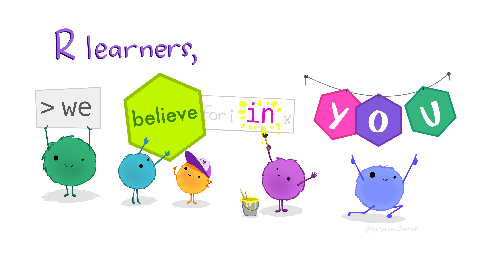

    <div class="social-icons">
      <a href="mailto: acarolinaledezmacarrizalez@gmail.com" class="social-icon teal">
        <i class="fas fa-envelope"></i>
      </a>
      <a href="[https://kuchikinamthip.github.io/NamthipService/TheNextGenSeqSquad/Main.html](https://kuchikinamthip.github.io/NamthipService/TheNextGenSeqSquad/Main.html)" class="social-icon teal">
        <i class="fas fa-globe"></i>
      </a>
      <a href="[https://www.linkedin.com/in/acarolinaledezma-carrizalez/](https://www.linkedin.com/in/acarolinaledezma-carrizalez/)" class="social-icon teal">
        <i class="fab fa-linkedin"></i>
      </a>
      <a href="[https://github.com/CarolaLedezma](https://github.com/CarolaLedezma)" class="social-icon teal">
        <i class="fab fa-github"></i>
      </a>
    </div>

  
  </div>

</div>

</html>
```
## Plantillas Cerradas 


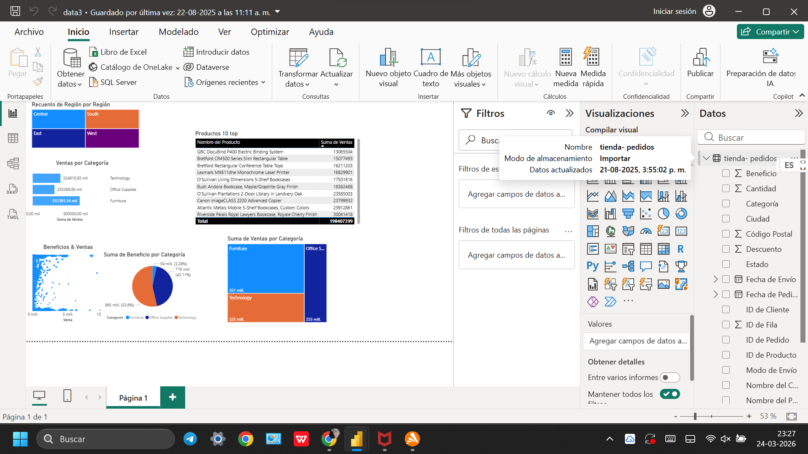{fig-align="center"}

## Estructuras Rigidas

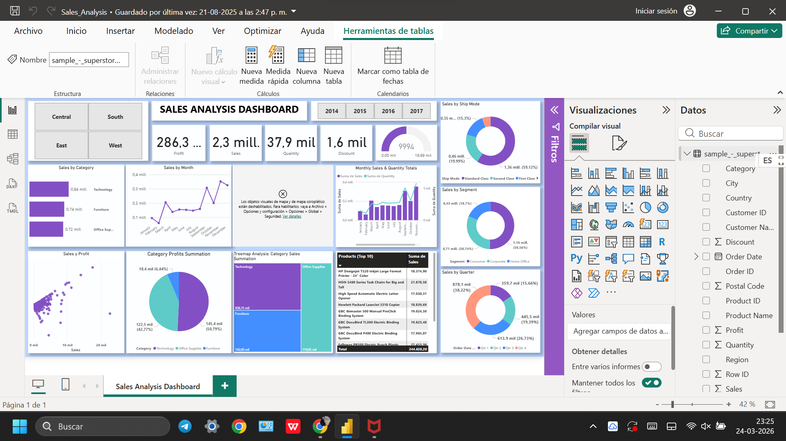{fig-align="center"}


## ¿Qué es R? {.center background-color="#1a1a1a"}
::::: columns

::: {.column width="60%"}
R no es solo una herramienta; es un ecosistema de código abierto donde el investigador posee el control total. Frente a los entornos cerrados que limitan el pensamiento a botones predefinidos, R ofrece una hoja en blanco para la creación científica sin restricciones.
:::

::: {.column width="40%"}
{fig-align="center"}
:::

:::::

--------------------------------------------------------------------------


## ggplot2: La Estética de la Precisión {.center background-color="#1a1a1a"}
::::: columns

::: {.column width="60%"}
Mientras otros sistemas ofrecen plantillas rígidas, ggplot2 implementa una gramática de gráficos real. Construimos capas de conocimiento: desde los datos crudos hasta la geometría y la estética final. Es la diferencia entre usar un molde y ser el escultor.
:::

::: {.column width="40%"}
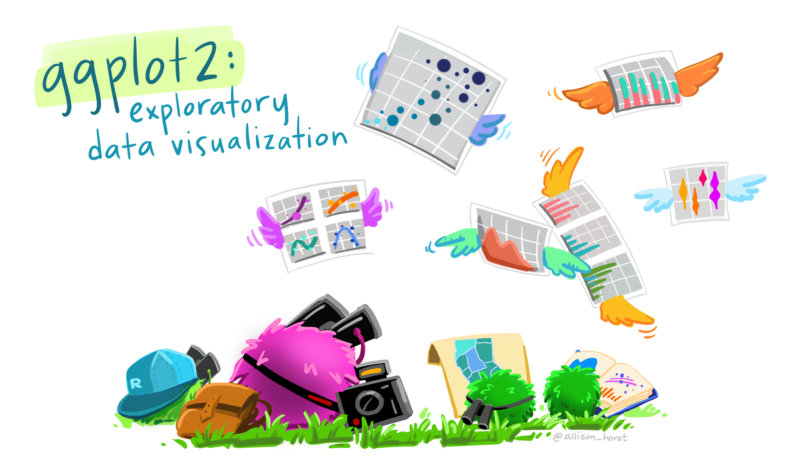{fig-align="center"}  
:::

:::::

-------------------------------------------------------------------------

## ¿Shiny? {.center background-color="#1a1a1a"}
::::: columns

::: {.column width="60%"}
Shiny es un paquete del lenguaje de programación R diseñado para construir aplicaciones web interactivas directamente desde tu código de análisis, sin necesidad de dominar lenguajes complejos de desarrollo web como HTML o JavaScript.
:::

::: {.column width="40%"}
{fig-align="center"}
:::

:::::

------------------------------------------------------------------------

## Porque ❤️ ggplot2

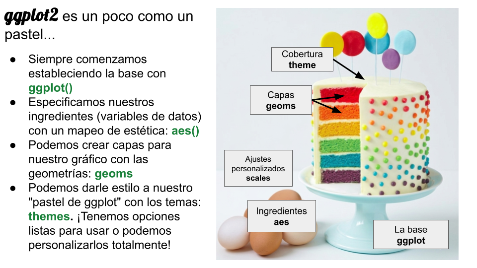{fig-alt="Slide comparing ggplot2 to a layered cake." fig-align="center"}

## Donde ocurre la magia

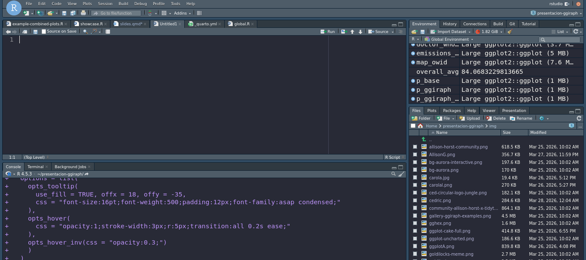{fig-align="center"}

-----------------------------------------------------------------------


##  {data-menu-title="Why we love ggplot2: Extensions" background-image="img/gghex.png" background-position="center" background-size="100%" background-color="#660068"}

::: footer
[ Explore Packages → <a style='color:#E8BEE9;' href='https://exts.ggplot2.tidyverse.org/gallery/'>ggplot2 Extension Gallery</a> + <a style='color:#E8BEE9;' href='https://github.com/erikgahner/awesome-ggplot2'>Awesome ggplot2 Project</a> ]{style="color:#D3D3D3;"}
:::

::: sr-only
A collection of extension packages for (and built with) ggplot2. A wild mixture of the most popular packages, packages for very specific use cases, packages that provide color palettes, and very experimental stuff.
:::


##  {data-menu-title="Why we love ggplot2: Community" background-image="img/community-allison-horst-x-tidytuesday.png" background-position="center" background-size="55%" background-color="#FFFFFF"}

::: sr-only
An illustration by Allison Horst: A person in a cape that reads “code hero” who looks like they are flying through the air while typing on a computer while saying “I’m doing a think all on my own!” The coder’s arms and legs have ropes attached to two hot air balloons lifting them up, with labels on the balloons including “teachers”, “bloggers”, “friends”, “developers”. Below the code hero, several people carry a trampoline with labels “support” and “community” that will catch them if they fall.
:::

::: footer
Illustración por [Allison Horst](https://allisonhorst.com/allison-horst)
:::


# ¿Por qué dinámicos?


## {.center}


:::: {style="text-align:center;"}
Los gráficos estáticos <b class="simple-highlight-3">cuentan</b> una historia.

::: fragment
¡Los gráficos dinámicos nos invitan <b class="simple-highlight-1">explorar</b> una historia!
:::
::::

<br><br><br>


------------------------------------------------------------------------

```{r}
#| label: bikes-showcase
#| echo: false
#| fig-align: center
girafe(
  ggobj = p_ggiraph_css, width_svg = 9, height_svg = 5.5,
  options = list(
    opts_tooltip(
      use_fill = TRUE, offx = 18, offy = -35,
      css = "font-size:16pt;font-weight:500;padding:12px;font-family:asap condensed;"
    ),
    opts_hover(
      css = "opacity:1;stroke-width:3px;r:5px;transition:all 0.2s ease;"
    ),
    opts_hover_inv(css = "opacity:0.3;")
    )
  )
```


------------------------------------------------------------------------

## ¿Por donde comenzamos?

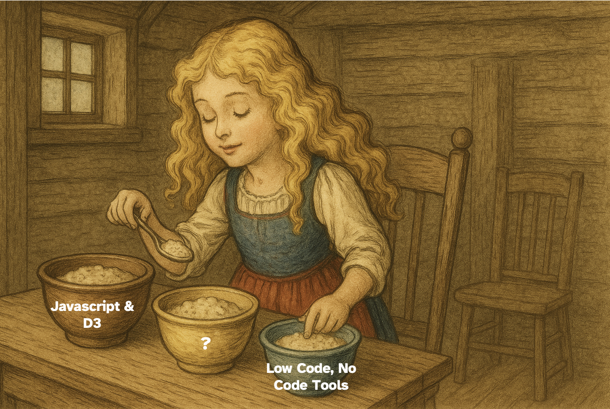{fig-align="center"}

## Gráficos y Dashboard

::::: columns

::: {.column width="40%"}
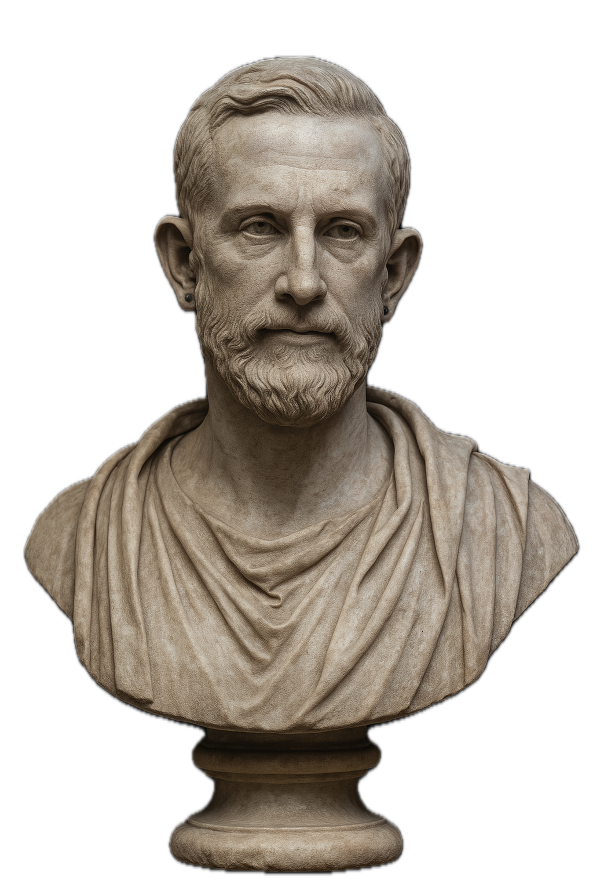{fig-alt="Hadley Wickham"}
<!--
<figure style="display:flex;flex-direction:column;justify-content:center;align-items:center;">


<span style="color:grey;font-size:1.2rem;font-family:piazzolla !important;">Hadley Wickham, Father of ggplot2</span>

</figure>
-->
:::

::: {.column width="60%" style="margin-top:15%;"}
<p class="quoted">
  Quieres mostrar lo mejor de ggplot2...<br>enseñales a Cédric Scherer y Allison Horst 
</p>
<p style="color: #505050;font-size: 1.4rem; font-family: piazzolla !important; line-height: 1.1;">
  por Hadley Wickham,<br>Padre de ggplot2
</p>
:::

:::::


## ...y me fui al sitio donde todo el mundo (que haga código) está

::::: columns

::: {.column width="50%"}
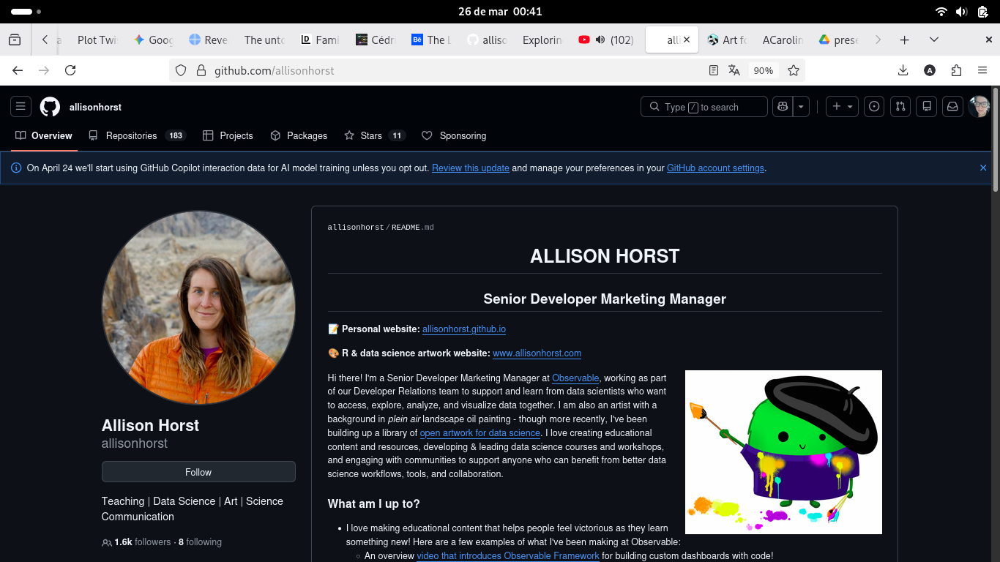{fig-alt="Allison Horst"}
:::


::: {.column width="50%"}
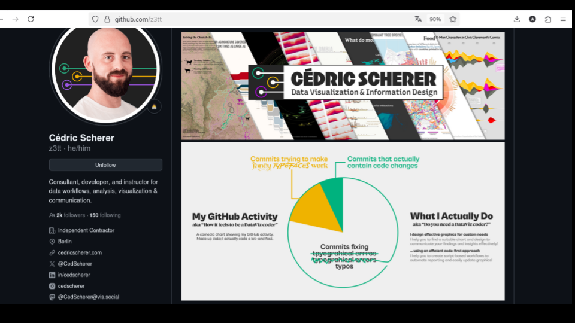{fig-align="center"}
:::

:::::


## ...y de Cédric & Tanya hice un Fork de esta presentación y la adacte para hoy...{background-color="#E1B0E1"}
### esó es bajo la filosofia de software libre 

* la libertad 0 (uso)
* la libertad 1 (mejora)


## Activamos nuestros graficos: con Tooltips

```{r}
#| label: heatmap-simpsons-simple
#| echo: false
#| fig-align: center

girafe(
  ggobj = p_simpsons,
  width_svg = 10.8, height_svg = 8.5,
  options = list(
    opts_tooltip(
      opacity = 1, use_fill = TRUE,
      css = "color: black; padding: 15px;"
    ),
    opts_sizing(width = .8),
    opts_hover(css = "stroke-width: 1;"),
    opts_hover_inv(css = "opacity: 0.3;")
  )
)
```


------------------------------------------------------------------------

```{r}
#| label: heatmap-simpsons-advanced
#| echo: false
#| fig-align: center

girafe(
  ggobj = p_simpsons_advanced,
  width_svg = 10.8, height_svg = 8.5,
  options = list(
    opts_tooltip(
      opacity = 1, use_fill = TRUE,
      css = "color: black; padding: 15px;"
    ),
    opts_sizing(width = .8),
    opts_hover(css = "stroke-width: 1;"),
    opts_hover_inv(css = "opacity: 0.3;")
  )
)
```


------------------------------------------------------------------------

## Otro ejemplo: Hovering (Flotando)

```{r}
#| label: doctor-who-basic
#| echo: false
#| fig-align: center


 ggiraph::girafe(
   ggobj = doctor_who_basic_plot,
   width_svg = 6.125, height_svg = 4.5,
   options = list(
      ggiraph::opts_toolbar(saveaspng = FALSE),
      ggiraph::opts_sizing(width = .8),
      ggiraph::opts_tooltip(css = "font-family:Roboto;"),
      ggiraph::opts_hover(css = "stroke:white;cursor:help;")
      )
   )
```

------------------------------------------------------------------------
## Efecto básico de flotar

```{r}
#| echo: true
#| eval: false
#| code-line-numbers: "3-12|157,158"


doctor_who_basic_plot<-ggplot() +
   #interactive points per episode
   ggiraph::geom_jitter_interactive(
     data = df_eps,
     position = position_jitter(seed = 42, height = .2, width = 3),
     mapping = aes(
       data_id = story_number,
       x = rating,
       y = reorder(doctor, avg_rating),
       fill = I(color),
       tooltip = tooltip
     ),
     shape = 21,
     color = "black",
     size = 3,
     alpha = 0.8
   ) +
   geomtextpath::geom_textvline(
     mapping = aes(
       xintercept = overall_avg,
       label = paste0("Overall Avg: ", round(overall_avg, 0))
     ),
     size = 3,
     color = pal_line,
     hjust = 0.86,
     vjust = -.2,
     family = "Roboto"
   ) +
   geom_segment(
     data = df_doc_avg,
     mapping = aes(
       x = avg_rating,
       xend = overall_avg,
       y = doctor,
       yend = doctor
     ),
     color = pal_line
   ) +
   geom_point(
     data = df_doc_avg,
     mapping = aes(x = avg_rating, y = doctor, fill = I(color)),
     shape = 21, 
     color = "white",
     size = 10
   ) +
   geom_image(
     data = df_doc_avg,
     mapping = aes(x = avg_rating, y = doctor, image = image),
     size = 0.06,
     asp = 1.61
   ) +
   geom_text(
     data = df_doc_avg,
     mapping = aes(
       x = avg_rating,
       y = doctor,
       label = round(avg_rating, 1)
     ),
     size = 2.5,
     fontface= "bold",
     color = "white",
     vjust = 3.75,
     family = "Roboto"
   ) +
   geom_textbox(
     data = df_doc_avg,
     mapping = aes(x = 59.1, y = doctor, label = label),
     family = "Roboto",
     fill = NA,
     box.size = NA,
     box.padding = unit(rep(0, 4), "pt"),
     color = pal_text,
     hjust = 0
   ) +
   #arrows
   annotate(
     geom = "text",
     label = "Avg Rating\nper Doctor",
     x = 76,
     y = 2.5,
     size = 2.5,
     color = "white",
     family = "Roboto"
   ) +
   geom_curve(
     mapping = aes(
       x = 77,
       xend = 81.4,
       y = 2.7,
       yend = 3
     ),
     color = "white",
     curvature = -0.2,
     linewidth = 0.3,
     arrow = arrow(length = unit(0.08, "in"))
   ) +
   geom_curve(
     mapping = aes(
       x = 77,
       xend = 80.8,
       y = 2.3,
       yend = 2
     ),
     color = "white",
     curvature = 0.2,
     linewidth = 0.3,
     arrow = arrow(length = unit(0.08, "in"))
   ) +
   scale_x_continuous(
     limits = c(59, 95),
     expand = c(0, 0),
     breaks = c(70, 75, 80, 85, 90, 95)
   ) +
   coord_equal(ratio = 50 / 12) +
   labs(
     title = "Doctor Who was The Best?",
     subtitle = "Ratings by Episode and Doctor for the popular TV series, Doctor Who.",
     x = "Rating"
   )+
   theme(
     legend.position = "none",
     plot.background = element_rect(fill = pal_bg, color = pal_bg),
     panel.background = element_blank(),
     panel.grid = element_blank(),
     plot.margin = margin(
       l = 20,
       r = 40,
       b = 10,
       t = 20
     ),
     plot.caption = element_text(size = 7, color = "grey80"),
     plot.title = element_text(
       size = 14,
       face = "bold",
       margin = margin(b = 5)
     ),
     plot.subtitle  = element_text(size = 9, color = "#BABABA"),
     text = element_text(color = pal_text, family = "Roboto"),
     axis.text = element_text(color = pal_text, family = "Roboto Mono"),
     axis.text.y = element_blank(),
     axis.title.y = element_blank(),
     axis.title.x = element_textbox_simple(
       margin = margin(t = 10),
       halign = 0.675,
       hjust = 0.5
     ),
     axis.ticks = element_blank()
   )
 


 ggiraph::girafe(
   ggobj = doctor_who_basic_plot,
   options = list(
      ggiraph::opts_toolbar(saveaspng = FALSE),
      ggiraph::opts_tooltip(css = "font-family:Roboto;"),
      #modify hover css
      ggiraph::opts_hover(css = "fill:white;stroke:grey;cursor:help;")
      )
   )
```


------------------------------------------------------------------------

```{r}
#| label: doctor-who-advanced
#| echo: false
#| fig-align: center


ggiraph::girafe(
  ggobj = doctor_who_advanced_plot,
  width_svg = 6.125, height_svg = 4.5,
  options = list(
    #turnoff download png
    ggiraph::opts_toolbar(saveaspng = FALSE),
    ggiraph::opts_sizing(width = .8),
    #default tooltip font
    ggiraph::opts_tooltip(
      css = "font-family:Roboto;"
    ),
    #remove default opts_hover settings
    ggiraph::opts_hover(
      girafe_css(
        css = ""
      )
    ),
    #inverted hover, color points grey
    ggiraph::opts_hover_inv(
      girafe_css(
        css = "", 
        point = "fill:#515151",
        text = NULL
      )
    )
  )
)
```

------------------------------------------------------------------------

## Efecto avanzado de Flotar

```{r}
#| echo: true
#| eval: false
#| code-line-numbers: "12-20"


ggiraph::girafe(
  ggobj = doctor_who_advanced_plot,
  width_svg = 6.125, height_svg = 4.5,
  options = list(
    #turnoff download png
    ggiraph::opts_toolbar(saveaspng = FALSE),
    ggiraph::opts_sizing(width = .8),
    #default tooltip font
    ggiraph::opts_tooltip(
      css = "font-family:Roboto;"
    ),
    #remove default opts_hover settings
    ggiraph::opts_hover(css=""),
    #inverted hover, use girafe_css for more control on hover elements
    ggiraph::opts_hover_inv(
      girafe_css(
        css = "", 
        point = "fill:#515151",
        text = NULL
      )
    )
  )
)

```

------------------------------------------------------------------------

## ...un caso de uso de creativo de ggiraph flotar<br><br>👀{background-color="#212121" transition="zoom"}


------------------------------------------------------------------------

##  {#slide3-id data-menu-title="advanced-hover-2"}

```{r}
#| label: emissions-plot
#| echo: false
#| fig-align: center


ggiraph::girafe(
  ggobj = emissions_plot,
  width_svg = 8,
  height_svg = 6,
  options = list(
    ggiraph::opts_toolbar(saveaspng = FALSE),
    ggiraph::opts_sizing(width = .9),
    opts_tooltip(css = "font-family:Roboto"),
    opts_hover(
      css = "stroke-opacity:100%;fill-opacity:100%",
      nearest_distance = NULL)
  )
)
   
```


## Ejemplo: Combo Gráficos

```{r}
#| label: example-combined-plots
#| echo: false
#| fig-align: center
girafe(
  ggobj = combined_owid, width_svg = 12, height_svg = 5.3,
  options = list(
    opts_tooltip(use_fill = TRUE, css = "
font-size: 17px; 
font-weight: 400; 
font-family: Spline Sans; 
color:white; 
padding: 10px; 
border:2px solid white;
border-radius: 5px; 
"), 
    opts_hover(css = "stroke: white; stroke-width: 0.5px; opacity: 1;"),
    opts_hover_inv(css = "opacity: 0.2;"),
    opts_toolbar(position = "bottomright"),
    opts_zoom(min = 1, max = 4)
  )
)
```


------------------------------------------------------

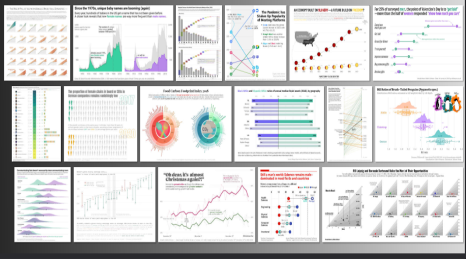{fig-align="center"}

-----------------------------------------------------


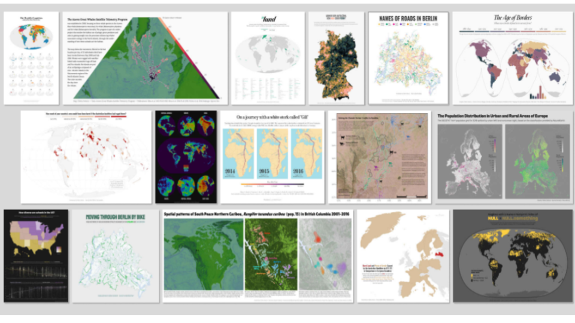{fig-align="center"}


-----------------------------------------------------

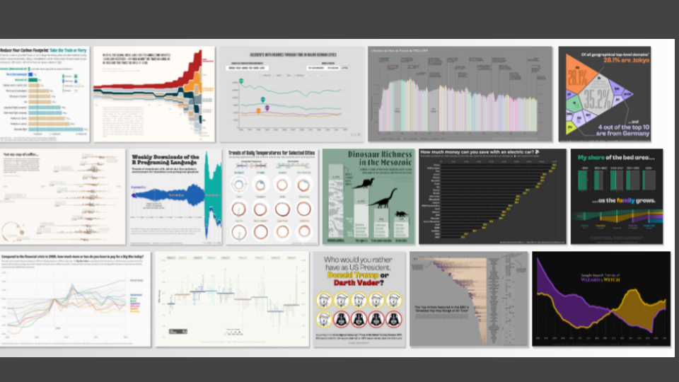{fig-align="center"}

--------------------------------------------------


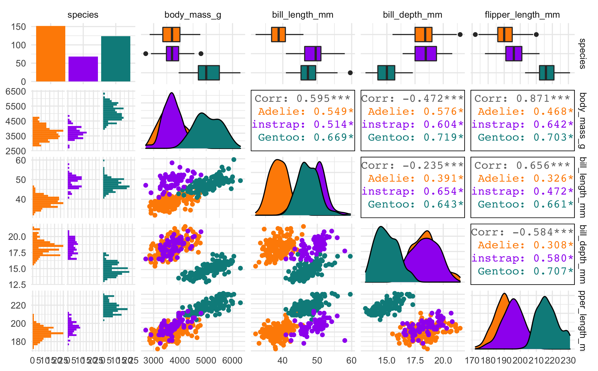{fig-align="center"}


# Allison Horst

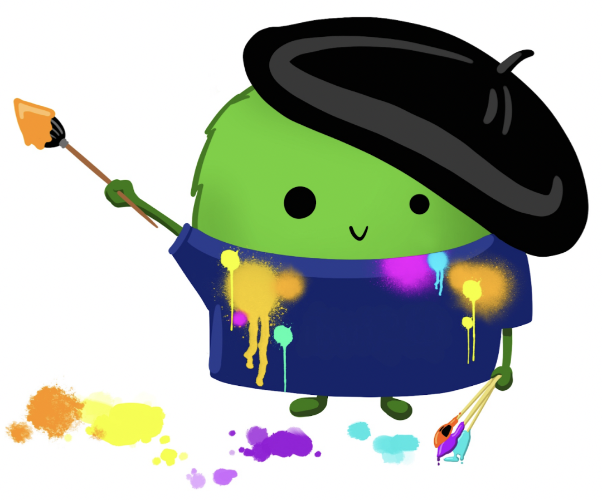{fig-align="center"}


----------------------------------------------------------


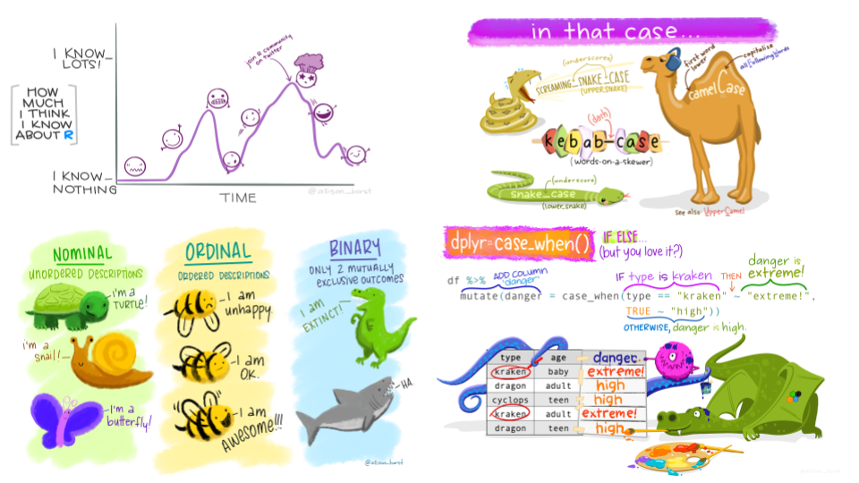{fig-align="center"}


------------------------------------------------------


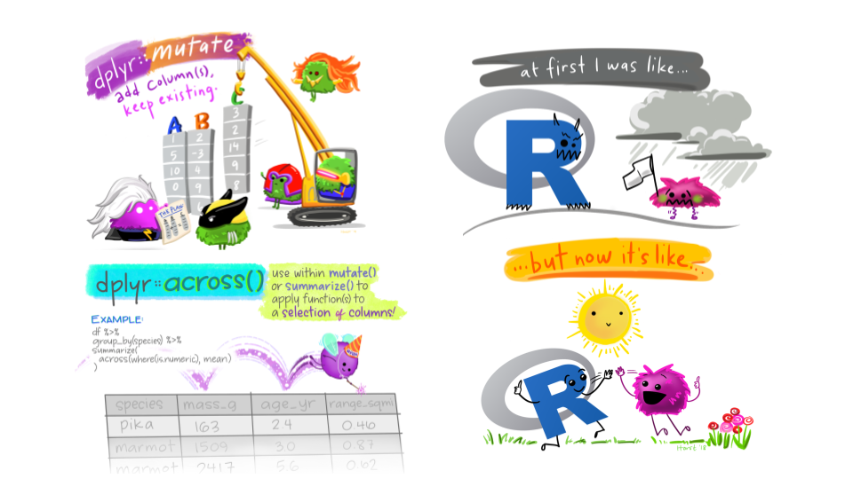{fig-align="center"}


------------------------------------------------------


## Ejemplo: Shiny

{fig-align="center"}


------------------------------------------------------------------------

## Shiny en acción

{fig-align="center"}

-------------------------------------------------------------

## <span style="color: #212121;">¡Muchas gracias!</span>

### <span class="simple-highlight-2">¿Quieren mas? usen Software Libre</span>


### <span class="simple-highlight-3">Gracias a Tanya Shapiro, Cédric Scherer y a Allison Horst</span>


##  {.center data-menu-title="ggplot2 [un]charted"}

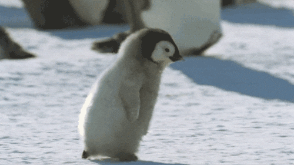{fig-align="center"}


::: footer
:::
